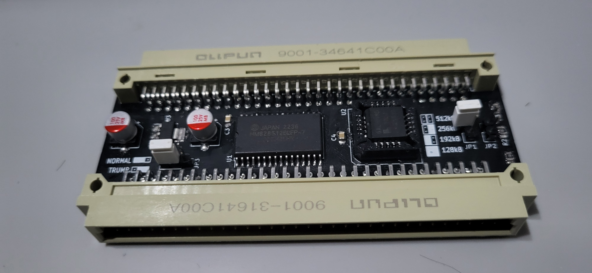

# QL Flex Memory Expansion

A 512kB external RAM expansion for the Sinclair QL, based on the design by
Alvaro Alea Fernandez. The circuit is the same as the original; this variant reworks
the board for easier assembly and flexible reconfiguration — hence the name.

Original project: https://github.com/alvaroalea/QL_512kb_External_Expansion

## What is different in QL Flex Memory Expansion (2025 revisions)

* The configuration solder jumpers are replaced with standard 2.54mm pin headers,
  so the memory configuration and the Trump Card mode can be changed with jumper
  caps instead of soldering.
* The GAL16V8 moved from a DIP-20 through-hole package to a PLCC-20 SMD socket,
  keeping the GAL removable and reprogrammable in a smaller footprint.
* Resistors and 100nF capacitors changed from 1206 to 0805.
* The silkscreen now carries the memory configuration table
  (00-512kB / 01-256kB / 10-192kB / 11-128kB), NORMAL/TRUMP labels for the mode
  header, and the board dimensions.
* Fabrication outputs are simplified to a single `gerbers/` folder.

Board size (97.79 × 35.56 mm) and the circuit itself are unchanged from the
original rev 3.

## About the board (from the original project)

This board will provide up to 512kB additional of static RAM (fast-ram) to the
Sinclair QL.

Two boards can be stacked to get a maximum of 896kB of memory (same as Miracle's
Trump Card).

Be aware you can not have 2 memory expansions in the same area (Jose Leandro's
QBide, Trump Card, etc...)

Provides an expansion connector to allow connecting additional interfaces.

There are 4 configurations available through the configuration headers (solder
jumpers in the original board):

* 512kB - This is the standard 512kB expansion for any QL
* 256kB - This is for use as a second expansion, uses the full QL space for a
  maximum of 896kB. Be aware that this is incompatible with a lot of expansion
  cards, so use with caution (any expansion card that does not use jumpers for
  configuration will be incompatible).
* 192kB - Similar to 256kB, provides additional space for expansion cards
  correctly configured.
* 128kB - Similar to 256kB, provides additional space for expansion cards
  correctly configured.

Be aware that the 128kB configuration can not be installed alone.
To be able to use 128kB, for a total of 768kB, it is mandatory to have an
additional expansion card that puts ROM at address E00000h; otherwise the QL ROM
will hang indicating RAM malfunction, because of a weird overlap of the internal
128kB with this external 128kB.

https://www.instagram.com/p/CZWfWcUM5mx/

In the `gal` folder there is the source code to be compiled with GALasm, which
you can find here: https://github.com/daveho/GALasm

## RAM test software

`software/memtest/` contains a RAM test for validating an assembled card on
the QL itself: a SuperBASIC front-end plus a 68008 machine-code core with
data-bus, address-bus, aliasing (GAL decode), March C− and checkerboard
tests, in both QDOS-safe and destructive full-window variants. See
[software/memtest/README.md](software/memtest/README.md).

## Mini Trump Card Compatibility

Alvaro also made a version of the Trump Card disk interface:
https://github.com/alvaroalea/QL_MiniTrump3 . That interface does not provide
memory like the original one. You can combine two of these RAM cards and the
MiniTrump to get the same as the original Trump Card.

You should connect the 512kB card to the QL, the MiniTrump card to the 512kB,
and the +256kB card to the MiniTrump. On this board, set the 3-pin mode header
(labelled NORMAL/TRUMP on the silkscreen) to the TRUMP position to allow the
MiniTrump card to coordinate with the second memory card.

## Credits and license

Original design (C) 2022 Alvaro Alea Fernandez, based on the work of McLeod
Ideafix, Jose Leandro, Zerover and tcat among others, with contributions from
www.va-de-retro.com

2025 revisions by ArleyJr.

Licensed under: CERN Open Hardware Licence Version 2 - Strongly Reciprocal

https://ohwr.org/cern_ohl_s_v2.txt

